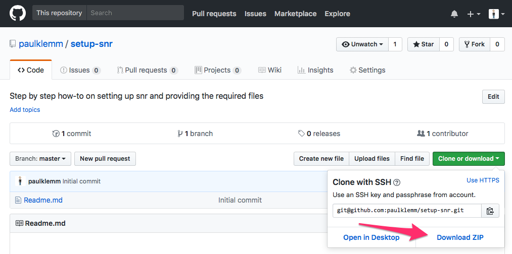

# Setup s·nr

**Always up-to date installation instructions are located in [https://github.com/snr-vis/setup-snr](https://github.com/snr-vis/setup-snr)**

## Requirements

* The only dependency for s·nr is docker. Please find the installation files for your system here: [https://www.docker.com/community-edition](https://www.docker.com/community-edition).
* Make sure to have at least `10-15 GB` of memory available for docker
* The public files occupy `7 GB` of disk space

## Download required files

{#fig:download_zip}

* Go to [https://github.com/snr-vis/setup-snr](https://github.com/snr-vis/setup-snr) and _either_ clone the repository or download it as a zip (Fig. @fig:download_zip.).
* Go into the path of the downloaded repository and run the following commands:

```bash
# Download the public files
make
# Run docker
docker pull paulklemm/snr
docker run -t -d \
    -p 3000:85 \
    -v $(pwd)/sonar:/home/opencpu/sonar \
    --name opencpu_rstudio \
    paulklemm/snr
```

Setting up the docker image can take a minute, depending on the system. You can now access s·nr under **[http://localhost:3000/](http://localhost:3000/)**.

Should you choose to expose the `OpenCPU` and `RStudio` instance running on the docker image, you can do so with the following call:

```bash
# Download the public files
make
# Run docker
docker pull paulklemm/snr
docker run -t -d \
    -p 3000:85 \
    -p 8004:8004 \
    -v $(pwd)/sonar:/home/opencpu/sonar \
    --name opencpu_rstudio \
    paulklemm/snr
```

**This is not recommended and should only be used for development purposes** because the `R` session of `OpenCPU` can access the whole docker file image and therefore all data stored there.

You find the servers at the following paths:

* `<ip-of-docker-host-machine>:<port>/ocpu` (e.g. [http://localhost:8004/ocpu/](http://localhost:8004/ocpu/))
* `<ip-of-docker-host-machine>:<port>/rstudio` (e.g. [http://localhost:8004/rstudio/](http://localhost:8004/rstudio/))

## Quickstart: Example script to start

This script requires a Unix (e.g. `macOS` or `Linux`) system with a running docker instance. It will download this repository and initialize s·nr.

```bash
# Setup snr directory
mkdir ~/snr
cd ~/snr
git clone https://github.com/snr-vis/setup-snr
cd setup-snr
# Download all public files
make
# Run the docker instance
docker pull paulklemm/snr
docker run -t -d \
    -p 3000:85 \
    -v $(pwd)/sonar:/home/opencpu/sonar \
    --name opencpu_rstudio \
    paulklemm/snr
```

## Download public data

The public data is available here **TODO LINK**.

To add it to the bootstrap file system of this repository run `make` which will download the files to `<repo-path>/sonar/data/quickngs`.

## Generate User file

The server's API allows the create a user file by specifying path and password by calling: `http://<url_to_server>:<port>/api/makeuserfilejson?pw=mypassword&path=/home/opencpu/sonar/data`. You can use the response to create or edit the user files.

### Workflow for creating a new user

1.  Create a new folder for the user in the folder that is linked to the `docker` `R` back-end and add the data there
1.  Create a `dictionary.json` file in that folder (see [Structure of Data and OpenCPU Sessions](#structure-of-data-and-opencpu-sessions))
1.  Check `server_settings.json` file where the user configuration files are
1.  Go to this directory and save the output of `http://<url_to_server>:<port>/api/makeuserfilejson?pw=<user_password>&path=<path_to_data_on_r_back_end>` to `<username>.json`
1.  Log in to sonar with the new account

## Additional Information

Please refer to the readme of the `snr` repository ([https://github.com/snr-vis/snr](https://github.com/snr-vis/snr)) for more details.
